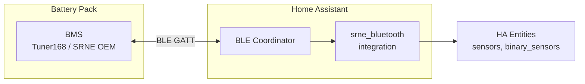

# SRNE Bluetooth — Home Assistant Custom Component

Read SRNE / PowMr LiFePO4 battery telemetry over **Bluetooth Low Energy**, with
no cloud dependency. This integration connects to the battery's internal BMS
via BLE and exposes cell voltages, temperatures, SOC, current, and protection
status as Home Assistant entities.

## Architecture

The BMS speaks **Modbus RTU over BLE**: the host writes a Modbus read frame to
`ffd1` and receives the response as a notification on `fff1`. A one-time login
write (`$CheckPinCode$ `) wakes the module first. (This is *not* the JBD/`0xDD`
protocol — that assumption was disproven during reverse-engineering.)

## Protocol — fully reverse-engineered ✅

The access sequence and realtime register map have been **captured live and
verified against Home Assistant**. See **[`docs/PROTOCOL.md`](docs/PROTOCOL.md)**
for the authoritative reference (framing, CRC, register map, working client) and
[`docs/GATT_RECON.md`](docs/GATT_RECON.md) for the GATT dump.

| Role | UUID | Handle | Notes |
|------|------|--------|-------|
| TX (write commands) | `0000ffd1-...` | `0x001c` | Modbus frames, write-no-response |
| RX (notifications) | `0000fff1-...` | `0x002d` | responses (service `fff0`) |

Access: connect → notify on `fff1` → write `$CheckPinCode$ ` → send
`FF 03 <addr> <count> <crc16>` to `ffd1` → parse `FF 03 <len> <data> <crc>`.

## Device Details

| Field | Value |
|-------|-------|
| Manufacturer | Tuner168 (OEM for SRNE / PowMr) |
| Model | `TC,R2#4,1,248,S` |
| Advertising name | `BAT1-xxxx` (suffix varies) |
| Modbus identity | model `FP-Bat`, type `LFP-B`, firmware `1.1.6` |
| Battery type | 16S LiFePO4, ~207 Ah |

## Related Projects

| Project | Description |
|---------|-------------|
| [GDeep/Tuner168BMS](https://github.com/GDeep/Tuner168BMS) | ESPHome/Tasmota component for Tuner168 BMS (WiFi/BLE) |
| [Louisvdw/dbus-blebattery](https://github.com/Louisvdw/dbus-blebattery) | Venus OS DBus driver for BLE batteries |
| [wg0z/jbd-bms-ble](https://github.com/wg0z/jbd-bms-ble) | JBD BMS BLE library (related protocol family) |

The Tuner168/SRNE BMS uses **Modbus RTU over BLE** (unit `0xFF`, function
`0x03`, CRC-16/Modbus), closest to the Renogy BMS family. It is *not* the
JBD/Xiaoxiang `0xDD` protocol. The command list was recovered from the
`com.srne.androidapp` (SRNE Monitoring) APK decompile.

## Hardware Requirements

- SRNE or PowMr LiFePO4 battery with built-in BLE BMS (Tuner168 OEM)
- ESP32, Raspberry Pi, or any machine running Home Assistant within BLE range
  (~10 m typical, varies by environment)
- BLE adapter supported by Home Assistant (BlueZ on Linux)

## Installation (future)

Not yet available. Planned distribution via HACS as a custom repository.

1. Add this repository as a custom repository in HACS.
2. Download the integration through HACS.
3. Restart Home Assistant.
4. Add integration via Settings -> Devices & Services.

## Configuration (future)

The config flow will support BLE discovery of nearby `BAT1-*` devices. The
user will select the target battery and the integration will handle the rest.

| Field | Description |
|-------|-------------|
| BLE Device | Auto-discovered or manually selected BAT1 device |
| Poll interval | How often to refresh telemetry (default 30 s) |

## TODO / Roadmap

- [x] Live GATT probing (direct from PC via `bleak`)
- [x] Reverse-engineer the command/response frame format (Modbus over BLE)
- [x] Decode cell voltages, temperatures, SOC, current, capacity (HA-verified)
- [ ] Bit-decode protection/alarm flag registers (`0x0309`–`0x030E`)
- [ ] Implement BLE coordinator with write/notify pattern
- [ ] Expose sensor entities for all decoded fields
- [ ] Add binary sensors for MOSFET status and protection alarms
- [ ] ESP32/ESPHome BLE-central poller near the battery bank (see PROTOCOL.md §9)
- [ ] HACS repository setup and manifest
- [ ] Config flow with BLE discovery
- [ ] Testing against real hardware

## Credits

Protocol reverse-engineered live from a BAT1 pack, cross-checked against Home
Assistant, with the command list recovered from the SRNE Monitoring APK. Built
with Claude Code.
